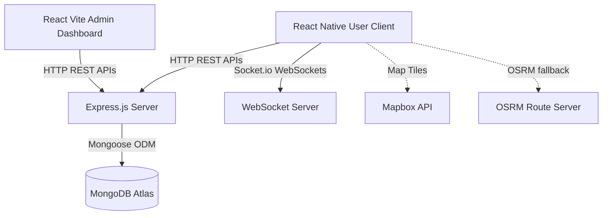

# System Architecture Documentation

## 1. High-Level Architecture Overview

NavX follows a decentralized client-server architecture. Heavy computational processes (such as live coordinates dead-reckoning tracking and routing/pathfinding fallback calculations) are executed on the user's mobile device to ensure offline capability. The central server manages vector storage, mapping configuration, updates broadcast, and chat sessions.



---

## 2. Frontend Architecture

### A. User Mobile App (React Native / Expo)
- **Folder Structure**:
  - `src/screens`: UI Pages (e.g. MapScreen, QRScanScreen, NavigationScreen).
  - `src/components`: UI blocks (e.g. AIChatOverlay, WeatherWidget).
  - `src/context`: React Context providers for authentication, geofencing monitoring, and live meeting sessions.
  - `src/positioning.js`: Core sensor fusion engine.
  - `src/api.js`: Axios request wrapper.
- **Routing**: `react-navigation` bottom tabs (`MainTabs`) wrapper containing `Home` and `Map`. Stacks include `QRScan`, `Navigation`, `LiveMeet`, `AR`, `Settings`, and `Auth`.
- **State Management**: React Context (`AuthContext`, `GeofenceContext`, `LiveMeetContext`) synced with `AsyncStorage` for local caching.

### B. Admin Web App (React / Vite)
- **Folder Structure**:
  - `src/pages`: Console dashboards (Dashboard, CampusManager, MapEditor).
  - `src/components`: AI assistants and context widgets.
  - `src/api.js`: Network utilities.
- **Routing**: `react-router-dom` routes (`/login`, `/dashboard`, `/campus/:campusCode/map-editor`).
- **Styling**: TailwindCSS utility framework combined with `index.css` global styles.

---

## 3. Backend Architecture

### API Layer
- Express Router files defining endpoints grouped by model resources (e.g. `/api/rooms`, `/api/campus`).
- WebSocket server handles:
  - Real-time updates: notifying clients of map updates.
  - Live Meet: broadcasting relative coordinate displacements to members in specific session rooms.
  - AI chat typing indicators on namespace `/ai-chat`.

### Middleware Services
- **Authentication**: JWT token validation, cookie matching, guest tokens issuing (`backend/utils/auth.js`).
- **Isolation/Security**: Campus isolation checking to prevent tenant admins from modifying entities of other venues.
- **Upload Helper**: Multer middleware managing image uploads (`backend/routes/upload.js`).

---

## 4. Database Schema (Mongoose Models)

NavX defines 11 primary collections in MongoDB:

1. **Campus**: Venue location center, boundary radius, active states, and emergency flags.
2. **Block**: Sector groups inside a campus, domains (e.g. "Academic Blocks"), shape specs.
3. **Floor**: Levels inside a block, dimension size, grid config.
4. **Room**: Individual location entities (classrooms, restrooms, elevators, entrances). Contains coordinates/polygons.
5. **NavNode**: Vector routing points (waypoints, intersections, doors).
6. **NavPath**: Line segment connecting two `NavNode` IDs with distance and bidirectional flags.
7. **QRCode**: Anchors associated with `NavNode` items used to calibrate user's indoor location.
8. **Beacon**: BLE items associated with `NavNode` IDs.
9. **LiveMeetSession**: Session codes, participants list, host data.
10. **Announcement (Campaign)**: Campus updates and banner notifications.
11. **Analytics**: Log collection recording routing metrics.

---

## 5. Authentication & Authorization Flow

```
User App (Guest)  --> Scan Entrance QR --> verifies GPS coords --> issues Guest JWT -> unlock geofence.
Admin User        --> enters email/pass  --> signs JWT token  --> returns HttpOnly cookie -> access dashboard.
```

- **Roles**:
  - `SuperAdmin`: Total privileges. Can create campuses, regenerate admin URLs, onboard admins.
  - `Admin`: Confined to a single campus. Can draw maps, configure beacons, publish campaigns.
  - `AppUser` / `Guest`: Confined to local geofence radius. Can view maps, navigate, use Live Meet.
